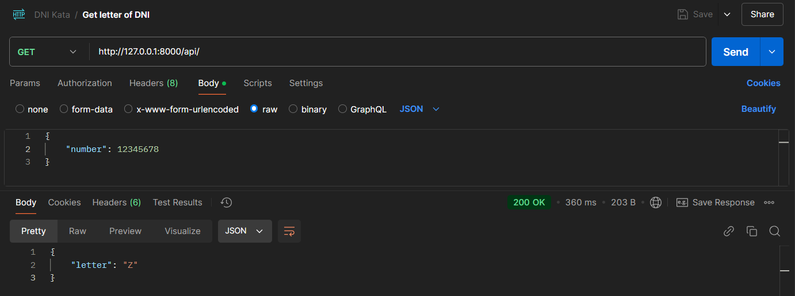
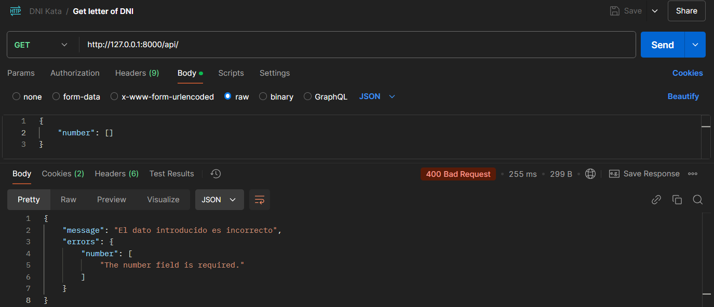
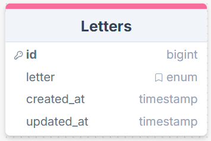

# Kata - DNI

>[!CAUTION]
>Por favor lea todos los punto del README para un correcto uso del proyecto. Gracias.

## 💡 Descripción

Este proyecto consiste en una aplicación en la que el usuario puede introducir por API su número de DNI (Documento Nacional de Identidad) para obtener la letra correspondiente.

Toda la funcionalidad es a través de API por lo que no existe ninguna funcionalidad a través de web.

## 💼 Guía del proyecto

Como ya se ha indicado anteriormente, solamente se puede introducir por API el número del DNI del cual queremos obtener la letra.

Debe ser un número entero entre 0 y 99999999, por lo que si el usuario introduce un número de una longitud incorrecta u otro dato que no sea de tipo número aparecerá un error indicándolo.

A continuación se ven varios ejemplos:


<p align="center"><em>Request correcta</em></p>


<p align="center"><em>Request de longitud incorrecta</em></p>


<p align="center"><em>Request de tipo incorrecto</em></p>

## ❓ Requisitos de instalación

Para poder probar este proyecto en local necesitarás:

1. XAMPP (o cualquier otro servidor local que soporte PHP y MySQL)

2. Terminal del Sistema Operativo

3. Instalar Composer

4. Instalar NPM via Node.js

5. Xdebug (para poder ver el test coverage)

6. Postman (o cualquier otra plataforma para usar la API, como *Insomnia*)

## 💻 Instalación

1. Clonar el repositorio:
```
    git clone https://github.com/ArianaMartinMartinez/Kata-DNI.git
```

2. Instalar Composer:
```
    composer install
```

3. Instalar NPM:
```
    npm install
```

4. Crear un archivo '.env' tomando de ejemplo el archivo '.env.example' y modificar las líneas:
    - DB_CONNECTION=mysql
    - DB_DATABASE=kata_dni

5. Crear una base de datos en MySQL vacías (yo uso *phpMyAdmin*)


6. Generar todas las tablas y rellenar las letras:
```
    php artisan migrate:fresh --seed
```

7. Correr NPM:
```
    npm run dev
```

8. Correr Laravel (en otra terminal):
```
    php artisan serve
```

Con todo esto será posible usar la API del proyecto con la URL que se genere este último comando.

## 📚 Diagrama de la base de datos

Este es el diagrama de la base de datos para este proyecto. Únicamente existe una tabla en la que se encuentran almacenadas las letras posibles para el DNI.



## 🔍 API Endpoints

En este proyecto existe un único endpoint para poder ver la letra del DNI devuelta según el número introducido:

```
    http://127.0.0.1:8000/api/
```

## 👾 Tests

Este proyecto tiene un **80%** de test coverage.

Puedes probar los tests y ver el coverage en la terminal usando:
```
   php artisan test --coverage
```


>[!TIP]
>También puedes ver el coverage en un navegador web usando:
>```
>   php artisan test --coverage-html=coverage-report
>```

## 🛠️ Tecnologías y herramientas

<a href='https://github.com/shivamkapasia0' target="_blank"></a>
<a href='https://github.com/shivamkapasia0' target="_blank"></a>
<a href='https://github.com/shivamkapasia0' target="_blank"></a>
<a href='https://github.com/shivamkapasia0' target="_blank"></a>

<a href='https://github.com/shivamkapasia0' target="_blank"></a>
<a href='https://github.com/shivamkapasia0' target="_blank"></a>
<a href='https://github.com/shivamkapasia0' target="_blank"></a>
<a href='https://github.com/shivamkapasia0' target="_blank"></a>
<a href='https://github.com/shivamkapasia0' target="_blank"></a>

## 👨🏻‍💻 Autora

Este proyecto fue desarrollado completamente por:

[Ariana Martín Martínez](https://github.com/ArianaMartinMartinez)